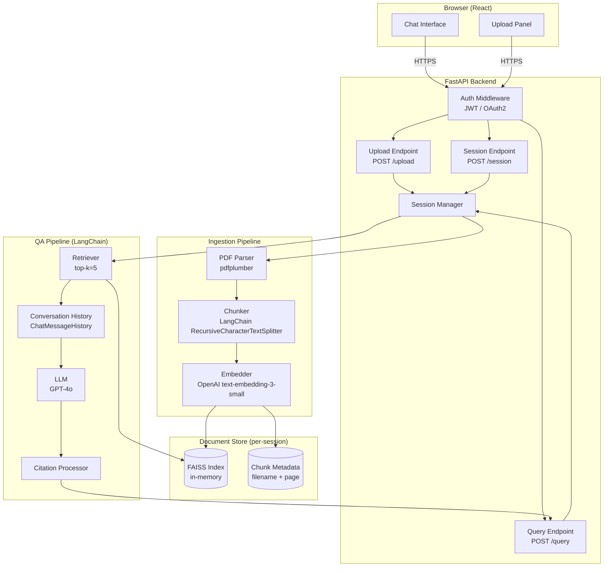
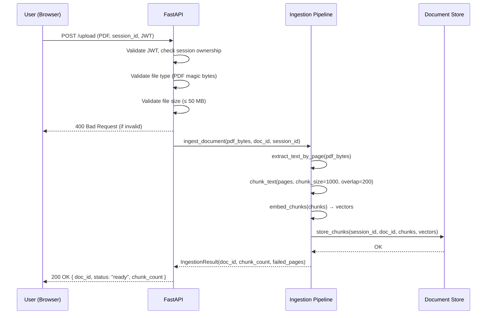
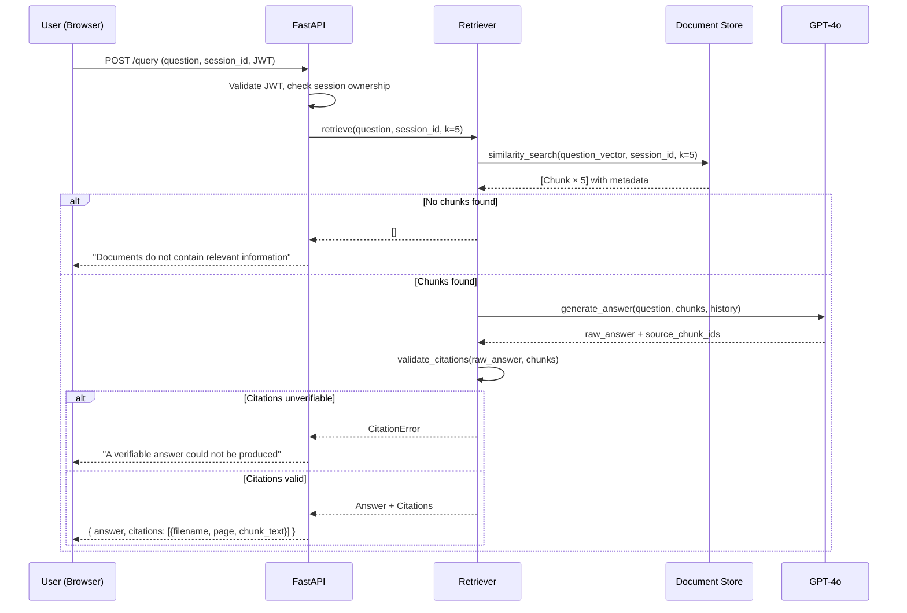

# Design Document — LawChain-AI PDF Chatbot

## Overview

LawChain-AI is a PDF-based conversational assistant built for professional settings such as law firms. Users upload one or more PDF documents into a session-scoped workspace; the system ingests, chunks, and embeds the document text into a vector store, then answers natural-language questions by retrieving the most relevant passages and generating grounded, cited responses via a large language model.

The system is built on a Python/FastAPI backend using LangChain as the orchestration layer, a FAISS vector store for per-session document retrieval, OpenAI embeddings and GPT-4o for generation, and a React frontend for the chat interface. All communication is over TLS; sessions are fully isolated and ephemeral.

---

## Architecture

### High-Level System Diagram



### Request Flow — Document Upload



### Request Flow — Question Answering



---

## Components and Interfaces

### Component 1: Auth Middleware

**Purpose**: Validates JWT tokens on every protected endpoint; enforces that users can only access their own sessions.

**Interface**:

```python
class AuthMiddleware:
    def authenticate(self, token: str) -> UserIdentity: ...
    def authorize_session(self, user_id: str, session_id: str) -> bool: ...
```

**Responsibilities**:

- Decode and verify JWT (HS256, configurable secret)
- Reject expired or malformed tokens with HTTP 401
- Confirm the requesting user owns the target session

---

### Component 2: Upload Endpoint

**Purpose**: Receives PDF files, validates them, and delegates to the Ingestion Pipeline.

**Interface**:

```python
@router.post("/upload")
async def upload_document(
    file: UploadFile,
    session_id: str,
    user: UserIdentity = Depends(auth_middleware),
) -> UploadResponse: ...
```

**Responsibilities**:

- Enforce 50 MB size limit
- Validate PDF magic bytes (`%PDF`)
- Enforce 20-document-per-session cap
- Return `UploadResponse` with `doc_id` and ingestion status

---

### Component 3: Ingestion Pipeline

**Purpose**: Parses PDFs, splits text into overlapping chunks, generates embeddings, and persists to the Document Store.

**Interface**:

```python
class IngestionPipeline:
    def ingest_document(
        self,
        pdf_bytes: bytes,
        doc_id: str,
        session_id: str,
        filename: str,
    ) -> IngestionResult: ...

    def extract_text_by_page(
        self, pdf_bytes: bytes
    ) -> list[PageText]: ...

    def chunk_text(
        self,
        pages: list[PageText],
        chunk_size: int = 1000,
        chunk_overlap: int = 200,
    ) -> list[Chunk]: ...

    def embed_chunks(
        self, chunks: list[Chunk]
    ) -> list[EmbeddedChunk]: ...
```

**Responsibilities**:

- Use `pdfplumber` for text extraction; log and skip failed pages
- Use LangChain `RecursiveCharacterTextSplitter` for chunking
- Attach `filename` and `page_number` metadata to every chunk
- Detect image-only PDFs and raise `OCRRequiredError`
- Complete ingestion of a 50-page document within 60 seconds

---

### Component 4: Document Store

**Purpose**: Manages per-session FAISS indexes and chunk metadata; enforces session isolation.

**Interface**:

```python
class DocumentStore:
    def store_chunks(
        self,
        session_id: str,
        embedded_chunks: list[EmbeddedChunk],
    ) -> None: ...

    def similarity_search(
        self,
        session_id: str,
        query_vector: list[float],
        k: int = 5,
    ) -> list[Chunk]: ...

    def delete_session(self, session_id: str) -> None: ...
```

**Responsibilities**:

- Maintain one FAISS `IndexFlatL2` per session in memory
- Filter results strictly to the requesting session's index
- On `delete_session`, remove the FAISS index and all metadata

---

### Component 5: QA Pipeline

**Purpose**: Orchestrates retrieval, history injection, LLM generation, and citation validation.

**Interface**:

```python
class QAPipeline:
    def answer(
        self,
        question: str,
        session_id: str,
        user_id: str,
    ) -> AnswerResult: ...

    def validate_citations(
        self,
        answer_text: str,
        source_chunks: list[Chunk],
    ) -> bool: ...
```

**Responsibilities**:

- Embed the question and call `DocumentStore.similarity_search`
- Inject conversation history via LangChain `ConversationBufferMemory`
- Build a `RetrievalQAWithSourcesChain` prompt that demands citations
- Validate that every cited chunk ID exists in the retrieved set
- Return `AnswerResult` with `answer`, `citations`, and `chunk_texts`

---

### Component 6: Session Manager

**Purpose**: Creates, tracks, and tears down sessions; enforces concurrency limits.

**Interface**:

```python
class SessionManager:
    def create_session(self, user_id: str) -> Session: ...
    def get_session(self, session_id: str, user_id: str) -> Session: ...
    def end_session(self, session_id: str, user_id: str) -> None: ...
    def active_session_count(self) -> int: ...
```

**Responsibilities**:

- Generate a UUID-based `session_id`
- Enforce isolation: each session has its own `DocumentStore` index and `ConversationBufferMemory`
- On `end_session`, call `DocumentStore.delete_session` and clear memory
- Support ≥ 10 concurrent sessions

---

### Component 7: Chat Interface (React)

**Purpose**: Provides the browser-based UI for document upload, question submission, and answer display with citations.

**Responsibilities**:

- Upload panel with drag-and-drop, progress indicator, and per-file status
- Chat thread showing questions, answers, and inline citation badges
- Citation expansion: clicking a badge reveals the source chunk text
- All API calls over HTTPS with JWT in `Authorization: Bearer` header

---

## Data Models

### UserIdentity

```python
@dataclass
class UserIdentity:
    user_id: str          # UUID
    email: str
    roles: list[str]      # e.g. ["lawyer", "admin"]
```

### Session

```python
@dataclass
class Session:
    session_id: str       # UUID
    user_id: str
    created_at: datetime
    document_ids: list[str]   # max 20
    memory: ConversationBufferMemory
    is_active: bool
```

### PageText

```python
@dataclass
class PageText:
    page_number: int      # 1-indexed
    text: str             # extracted plain text; empty string if extraction failed
    extraction_failed: bool
```

### Chunk

```python
@dataclass
class Chunk:
    chunk_id: str         # UUID
    doc_id: str
    session_id: str
    filename: str
    page_number: int
    text: str
    token_count: int      # ≤ 1000
```

### EmbeddedChunk

```python
@dataclass
class EmbeddedChunk:
    chunk: Chunk
    vector: list[float]   # 1536-dim for text-embedding-3-small
```

### Citation

```python
@dataclass
class Citation:
    chunk_id: str
    filename: str
    page_number: int
    chunk_text: str
```

### AnswerResult

```python
@dataclass
class AnswerResult:
    answer: str
    citations: list[Citation]
    session_id: str
    question: str
```

### IngestionResult

```python
@dataclass
class IngestionResult:
    doc_id: str
    filename: str
    chunk_count: int
    failed_pages: list[int]
    status: Literal["ready", "error"]
    error_message: str | None
```

### UploadResponse

```python
@dataclass
class UploadResponse:
    doc_id: str
    filename: str
    status: Literal["ready", "error"]
    chunk_count: int
    error_message: str | None
```

---

## Key Functions with Formal Specifications

### `extract_text_by_page(pdf_bytes: bytes) -> list[PageText]`

**Preconditions:**

- `pdf_bytes` is non-empty
- `pdf_bytes` begins with the PDF magic bytes `%PDF`

**Postconditions:**

- Returns a list with one `PageText` entry per page in the document
- For each page where extraction succeeds: `page.extraction_failed == False` and `page.text` is a non-empty string
- For each page where extraction fails: `page.extraction_failed == True`, `page.text == ""`, and the failure is logged
- The list is ordered by ascending `page_number`
- If ALL pages fail extraction and the document appears image-only, raises `OCRRequiredError`

**Loop Invariant (page iteration):**

- After processing page `i`, `result[0..i]` contains valid `PageText` entries with correct `page_number` values

---

### `chunk_text(pages, chunk_size=1000, chunk_overlap=200) -> list[Chunk]`

**Preconditions:**

- `pages` is a non-empty list of `PageText`
- `chunk_size > chunk_overlap >= 0`
- At least one page has `extraction_failed == False`

**Postconditions:**

- Returns a non-empty list of `Chunk` objects
- For every chunk `c`: `c.token_count <= chunk_size`
- Consecutive chunks from the same page overlap by approximately `chunk_overlap` tokens
- Every chunk carries the correct `page_number` from its source page
- No chunk is produced from a page where `extraction_failed == True`

**Loop Invariant (chunk assembly):**

- All chunks produced so far have `token_count <= chunk_size` and valid `page_number` metadata

---

### `embed_chunks(chunks: list[Chunk]) -> list[EmbeddedChunk]`

**Preconditions:**

- `chunks` is non-empty
- Each `chunk.text` is a non-empty string

**Postconditions:**

- Returns a list of `EmbeddedChunk` with `len(result) == len(chunks)`
- Each `embedded.vector` has length 1536 (OpenAI `text-embedding-3-small` dimensionality)
- The order of `EmbeddedChunk` matches the order of input `chunks`

---

### `similarity_search(session_id, query_vector, k=5) -> list[Chunk]`

**Preconditions:**

- A FAISS index exists for `session_id`
- `len(query_vector) == 1536`
- `k >= 1`

**Postconditions:**

- Returns at most `k` chunks
- All returned chunks have `chunk.session_id == session_id` (session isolation)
- Chunks are ordered by ascending L2 distance to `query_vector`
- Returns an empty list if the index contains no vectors

---

### `validate_citations(answer_text, source_chunks) -> bool`

**Preconditions:**

- `answer_text` is a non-empty string
- `source_chunks` is the exact list returned by the retrieval step for this query

**Postconditions:**

- Returns `True` if and only if every `chunk_id` referenced in `answer_text` exists in `source_chunks`
- Returns `False` if `answer_text` references any chunk not in `source_chunks`
- Does not mutate `answer_text` or `source_chunks`

---

## Algorithmic Pseudocode

### Main Ingestion Algorithm

```pascal
PROCEDURE ingest_document(pdf_bytes, doc_id, session_id, filename)
  INPUT: pdf_bytes: bytes, doc_id: UUID, session_id: UUID, filename: string
  OUTPUT: IngestionResult

  SEQUENCE
    // Validate PDF magic bytes
    IF NOT starts_with(pdf_bytes, "%PDF") THEN
      RETURN IngestionResult(status="error", error_message="Not a valid PDF")
    END IF

    // Phase 1: Text extraction
    pages ← extract_text_by_page(pdf_bytes)

    IF all_pages_image_only(pages) THEN
      RAISE OCRRequiredError("Document requires OCR processing")
    END IF

    failed_pages ← [p.page_number FOR p IN pages WHERE p.extraction_failed]
    FOR each failed_page IN failed_pages DO
      LOG warning("Page extraction failed", doc_id, failed_page)
    END FOR

    // Phase 2: Chunking
    valid_pages ← [p FOR p IN pages WHERE NOT p.extraction_failed]
    chunks ← chunk_text(valid_pages, chunk_size=1000, chunk_overlap=200)

    ASSERT len(chunks) > 0

    // Phase 3: Embedding
    embedded_chunks ← embed_chunks(chunks)

    ASSERT len(embedded_chunks) == len(chunks)

    // Phase 4: Storage
    document_store.store_chunks(session_id, embedded_chunks)

    RETURN IngestionResult(
      doc_id=doc_id,
      filename=filename,
      chunk_count=len(chunks),
      failed_pages=failed_pages,
      status="ready"
    )
  END SEQUENCE
END PROCEDURE
```

---

### Main QA Algorithm

```pascal
PROCEDURE answer_question(question, session_id, user_id)
  INPUT: question: string, session_id: UUID, user_id: UUID
  OUTPUT: AnswerResult OR error response

  SEQUENCE
    // Step 1: Authorize
    session ← session_manager.get_session(session_id, user_id)
    IF session IS NULL OR NOT session.is_active THEN
      RAISE AuthorizationError("Invalid or expired session")
    END IF

    // Step 2: Embed question
    query_vector ← embedder.embed(question)

    // Step 3: Retrieve relevant chunks
    chunks ← document_store.similarity_search(session_id, query_vector, k=5)

    IF len(chunks) == 0 THEN
      RETURN no_relevant_info_response()
    END IF

    // Step 4: Build prompt with history
    history ← session.memory.load_memory_variables()
    prompt ← build_rag_prompt(question, chunks, history)

    // Step 5: Generate answer
    raw_response ← llm.generate(prompt)

    // Step 6: Validate citations
    citations_valid ← validate_citations(raw_response.answer, chunks)

    IF NOT citations_valid THEN
      RETURN citation_error_response()
    END IF

    // Step 7: Build and store result
    citations ← extract_citations(raw_response, chunks)
    result ← AnswerResult(
      answer=raw_response.answer,
      citations=citations,
      session_id=session_id,
      question=question
    )

    session.memory.save_context(question, result.answer)

    RETURN result
  END SEQUENCE
END PROCEDURE
```

---

### Chunk Text Algorithm

```pascal
PROCEDURE chunk_text(pages, chunk_size, chunk_overlap)
  INPUT: pages: list[PageText], chunk_size: int, chunk_overlap: int
  OUTPUT: list[Chunk]

  SEQUENCE
    splitter ← RecursiveCharacterTextSplitter(
      chunk_size=chunk_size,
      chunk_overlap=chunk_overlap,
      length_function=token_count
    )
    result ← []

    FOR each page IN pages DO
      ASSERT NOT page.extraction_failed

      raw_chunks ← splitter.split_text(page.text)

      FOR each raw_chunk IN raw_chunks DO
        ASSERT token_count(raw_chunk) <= chunk_size  // loop invariant

        chunk ← Chunk(
          chunk_id=generate_uuid(),
          doc_id=page.doc_id,
          session_id=page.session_id,
          filename=page.filename,
          page_number=page.page_number,
          text=raw_chunk,
          token_count=token_count(raw_chunk)
        )
        result.append(chunk)
      END FOR
    END FOR

    ASSERT len(result) > 0
    RETURN result
  END SEQUENCE
END PROCEDURE
```

---

### Session Teardown Algorithm

```pascal
PROCEDURE end_session(session_id, user_id)
  INPUT: session_id: UUID, user_id: UUID
  OUTPUT: void

  SEQUENCE
    session ← session_manager.get_session(session_id, user_id)

    IF session IS NULL THEN
      RAISE NotFoundError("Session not found")
    END IF

    IF session.user_id != user_id THEN
      RAISE AuthorizationError("Access denied")
    END IF

    // Delete all vectors and metadata for this session
    document_store.delete_session(session_id)

    // Clear conversation memory
    session.memory.clear()

    // Mark session inactive
    session.is_active ← false
    session_manager.remove(session_id)

    LOG info("Session ended", session_id, user_id)
  END SEQUENCE
END PROCEDURE
```

---

## Error Handling

### Error Scenario 1: Invalid File Type

**Condition**: Uploaded file does not begin with `%PDF` magic bytes.
**Response**: HTTP 400 with `{ "error": "InvalidFileType", "message": "File '<name>' is not a valid PDF." }`
**Recovery**: User corrects the file and re-uploads; no session state is affected.

### Error Scenario 2: File Too Large

**Condition**: Uploaded file exceeds 50 MB.
**Response**: HTTP 413 with `{ "error": "FileTooLarge", "message": "File '<name>' exceeds the 50 MB limit." }`
**Recovery**: User compresses or splits the document before re-uploading.

### Error Scenario 3: Session Document Cap Exceeded

**Condition**: User attempts to upload a 21st document in a session.
**Response**: HTTP 422 with `{ "error": "SessionCapExceeded", "message": "Sessions are limited to 20 documents." }`
**Recovery**: User starts a new session or removes an existing document.

### Error Scenario 4: Page Extraction Failure

**Condition**: `pdfplumber` raises an exception on one or more pages.
**Response**: Failure is logged; affected pages are skipped; ingestion continues. Final `IngestionResult.failed_pages` lists the skipped page numbers. User is notified via the upload status response.
**Recovery**: Partial document is still queryable; user is aware of missing pages.

### Error Scenario 5: Image-Only PDF (OCR Required)

**Condition**: All pages yield empty text (scanned document with no selectable text).
**Response**: HTTP 422 with `{ "error": "OCRRequired", "message": "Document '<name>' contains only scanned images and requires OCR processing." }`
**Recovery**: User pre-processes the PDF with an OCR tool before uploading.

### Error Scenario 6: No Relevant Chunks Found

**Condition**: `similarity_search` returns an empty list for the user's question.
**Response**: HTTP 200 with `{ "answer": "The uploaded documents do not contain information relevant to your question.", "citations": [] }`
**Recovery**: User rephrases the question or uploads additional documents.

### Error Scenario 7: Unverifiable Citation

**Condition**: LLM response references a chunk ID not present in the retrieved set.
**Response**: HTTP 200 with `{ "error": "CitationUnverifiable", "message": "A verifiable answer could not be produced. Please rephrase your question." }`
**Recovery**: User rephrases; system retries retrieval.

### Error Scenario 8: Authentication Failure

**Condition**: JWT is missing, expired, or invalid.
**Response**: HTTP 401 with `{ "error": "Unauthorized", "message": "Authentication required." }`
**Recovery**: User re-authenticates and retries.

---

## Testing Strategy

### Unit Testing Approach

Use `pytest` for all unit tests. Each component is tested in isolation with mocked dependencies.

Key unit test cases:

- `extract_text_by_page`: valid PDF, multi-page PDF, single failed page, all-image PDF
- `chunk_text`: chunk size boundary (exactly 1000 tokens), overlap correctness, empty page skipping
- `embed_chunks`: output dimensionality (1536), output length matches input length
- `similarity_search`: session isolation (results from session A never appear in session B queries)
- `validate_citations`: all valid, one invalid, empty answer
- `end_session`: FAISS index deleted, memory cleared, session marked inactive

### Property-Based Testing Approach

Use **Hypothesis** (Python) for property-based tests targeting Requirement 5 (Document Parsing Correctness).

**Property Test Library**: `hypothesis` with `hypothesis-pytest` integration

#### Property 1: Round-Trip Chunking Stability (Req 5.1)

```python
from hypothesis import given, strategies as st

@given(st.text(min_size=100, max_size=10000))
def test_chunk_roundtrip(text: str):
    """
    Property: chunking plain text, re-joining, and re-chunking
    produces the same number of chunks and equivalent content.
    """
    chunks_1 = chunk_text_from_string(text, chunk_size=1000, overlap=200)
    rejoined = " ".join(c.text for c in chunks_1)
    chunks_2 = chunk_text_from_string(rejoined, chunk_size=1000, overlap=200)
    # Content equivalence: same total token count (within overlap tolerance)
    assert abs(total_tokens(chunks_1) - total_tokens(chunks_2)) <= 200 * len(chunks_1)
```

#### Property 2: Non-Empty Chunks for Text-Bearing PDFs (Req 5.2)

```python
@given(st.lists(
    st.text(min_size=10, max_size=5000),
    min_size=1, max_size=50
))
def test_nonempty_chunks_for_text_pages(page_texts: list[str]):
    """
    Property: any document with at least one page of selectable text
    produces a non-empty chunk list.
    """
    pages = [PageText(page_number=i+1, text=t, extraction_failed=False)
             for i, t in enumerate(page_texts)]
    chunks = chunk_text(pages, chunk_size=1000, chunk_overlap=200)
    assert len(chunks) > 0
```

#### Property 3: Chunk Size Bound (Req 2.2)

```python
@given(st.text(min_size=1, max_size=50000))
def test_chunk_size_never_exceeds_limit(text: str):
    """
    Property: no chunk produced by the splitter exceeds 1000 tokens.
    """
    pages = [PageText(page_number=1, text=text, extraction_failed=False)]
    chunks = chunk_text(pages, chunk_size=1000, chunk_overlap=200)
    for chunk in chunks:
        assert chunk.token_count <= 1000
```

#### Property 4: Session Isolation (Req 7.2)

```python
@given(
    st.lists(st.text(min_size=10), min_size=1, max_size=5),
    st.lists(st.text(min_size=10), min_size=1, max_size=5),
)
def test_session_isolation(session_a_texts, session_b_texts):
    """
    Property: similarity search on session A never returns chunks
    belonging to session B, regardless of content similarity.
    """
    store = DocumentStore()
    # ... populate both sessions, query session A, assert all results have session_id == A
```

### Integration Testing Approach

- End-to-end test: upload a real PDF → query → verify citation points to correct page
- Concurrency test: spin up 10 parallel sessions, submit simultaneous queries, assert all respond within 20 seconds
- Session teardown test: end session, attempt query, assert 404/401

---

## Performance Considerations

- **Ingestion latency**: Target ≤ 60 seconds for a 50-page document. Embedding calls are batched (OpenAI supports up to 2048 inputs per request). `pdfplumber` extraction is CPU-bound; run in a `ProcessPoolExecutor` for large documents.
- **Query latency**: Target ≤ 10 seconds end-to-end. FAISS `IndexFlatL2` search is O(n·d) but fast for per-session indexes (typically < 10,000 vectors). LLM streaming (`stream=True`) can reduce perceived latency.
- **Concurrency**: 10 concurrent sessions each with an in-memory FAISS index. At ~1,536 floats × 4 bytes × 10,000 chunks ≈ 60 MB per session; 10 sessions ≈ 600 MB RAM. Use `asyncio` + `uvicorn` workers to handle concurrent requests without blocking.
- **Upload throughput**: FastAPI handles multipart uploads asynchronously; large files are streamed to avoid loading the full 50 MB into memory at once.

---

## Security Considerations

- **Authentication**: JWT (HS256) with short expiry (15 minutes) + refresh tokens. All endpoints protected by `AuthMiddleware`.
- **Session isolation**: FAISS indexes are keyed by `session_id`; the `similarity_search` method enforces that only the requesting session's index is queried. No cross-session data leakage is possible by design.
- **TLS**: FastAPI served behind an HTTPS-terminating reverse proxy (nginx or AWS ALB). TLS 1.2 minimum enforced at the proxy layer.
- **Data retention**: On session end, `DocumentStore.delete_session` removes all vectors and metadata. No PDF bytes are persisted to disk; they are processed in memory and discarded.
- **Input validation**: File type validated by magic bytes (not just extension). File size validated before reading content. Question length capped at 2,000 characters to prevent prompt injection amplification.
- **Prompt injection**: System prompt instructs the LLM to answer only from provided context and to refuse instructions embedded in document text.
- **Secrets management**: OpenAI API key and JWT secret loaded from environment variables; never hardcoded or logged.

---

## Dependencies

| Package                     | Version  | Purpose                            |
| --------------------------- | -------- | ---------------------------------- |
| `fastapi`                   | `^0.111` | REST API framework                 |
| `uvicorn[standard]`         | `^0.30`  | ASGI server                        |
| `langchain`                 | `^0.2`   | LLM orchestration, chains, memory  |
| `langchain-openai`          | `^0.1`   | OpenAI embeddings + chat model     |
| `langchain-community`       | `^0.2`   | FAISS vector store integration     |
| `faiss-cpu`                 | `^1.8`   | In-memory vector similarity search |
| `pdfplumber`                | `^0.11`  | PDF text extraction                |
| `pydantic`                  | `^2.7`   | Data validation and settings       |
| `python-jose[cryptography]` | `^3.3`   | JWT encode/decode                  |
| `python-multipart`          | `^0.0.9` | Multipart file upload support      |
| `tiktoken`                  | `^0.7`   | Token counting for chunking        |
| `pytest`                    | `^8.2`   | Unit and integration testing       |
| `hypothesis`                | `^6.103` | Property-based testing             |
| `react`                     | `^18`    | Frontend UI framework              |
| `axios`                     | `^1.7`   | HTTP client for API calls          |
